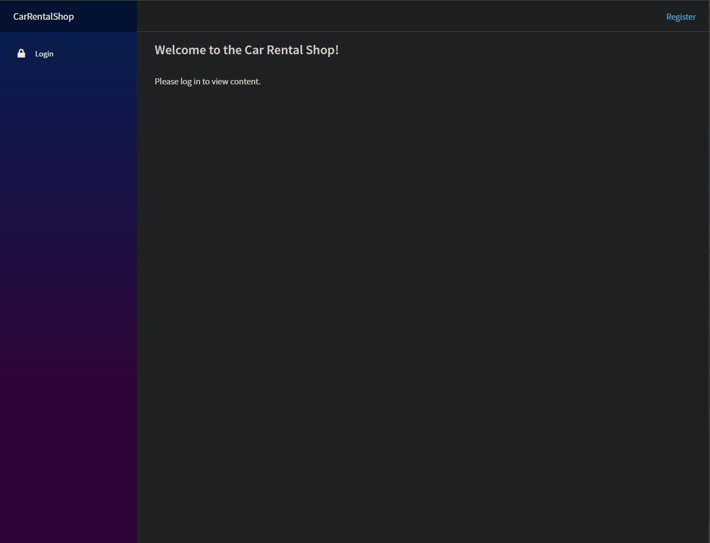
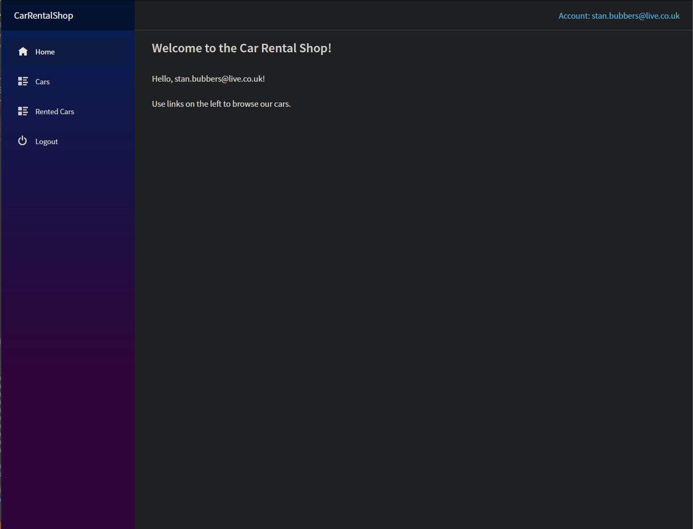
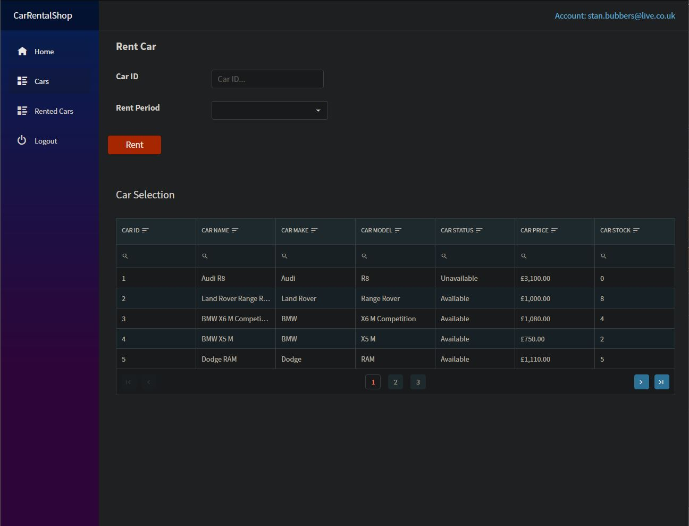
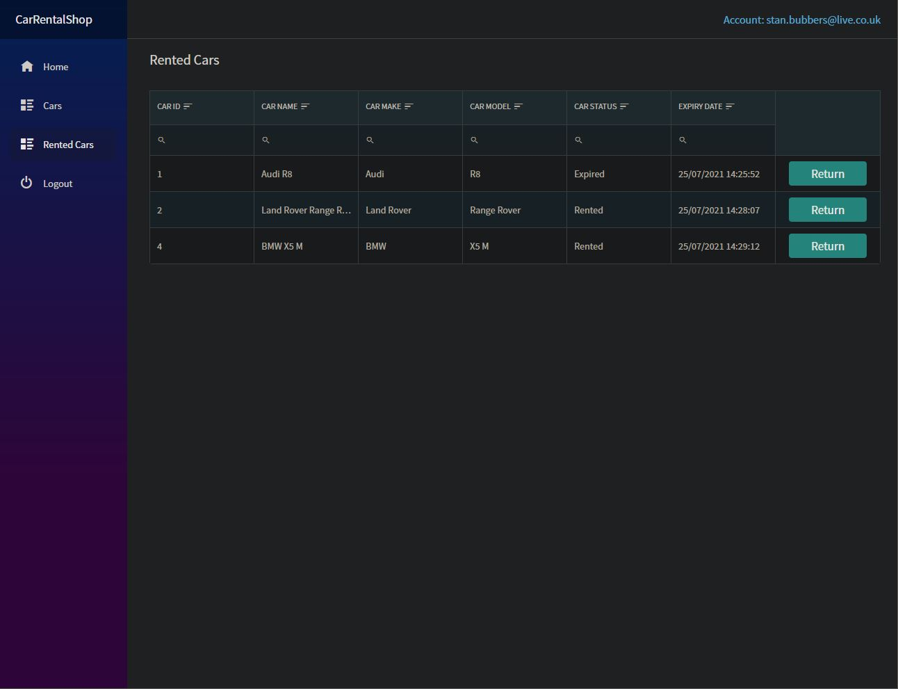

# Car Rental Shop
Car rental shop web application

User stories implemented:

· As a user, I should be able to register and login into the application.

· As a user, I should be able to get all the car categories.

· As a user, I should get all cars from 1 manufacturer and check the vehicles' status and stock.

· As a user, I should get all the vehicles by page (5 per page), Price (ascending, descending).

· As a user, I should be able to search the vehicle by name.

· As a user, I should rent a car (1-day minimum and seven days maximum).

· As a user, I should receive a notification that the contract is expiring (6 hours before the expiration date). (Using Sendgrid API to send notification) 

____

    
    
    
    
